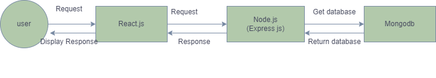

# Tech Hub💙
## Problem Statement: 
- To fill the communication gap between the people and technology , this application comes up with the idea of more interaction on the platform. 
- The people would like to interact with others just by following them in the app.


### Objective:
- As the technology is growing, everyone need to update themselves with the new tech feeds.
- Users are first need to login to the application then  each user,a database is created.

- So by using this application , we can see the tech information which is newly arrived, that is available in the home page of app and in different users section also.

- Anyone can post the tech feeds, that is users can upload their posts by using the new post  button in their specific post details section using database.

- Users can raise any doubts or suggestions with the comment facility. And these comments are stored in  user database.
- The security can be provided by login credentials.


### Features:

- Login / Signup :
    - Users should need to sign up with the basic details
        - Name, phone number, email, password, DOB, gender, security question , profile picture.
        - After signup completion , the user need to sign in when he visits next time.
        - Then , the user moved to home page of app.
- Home page:
    - The home page consists of different tech fields , the user can select various fields which he wants and can see the defferent posts 
    - And all posts are arranged randomly.
- Posts page:
    - The user can post his posts , and see his friends too.
    - The users can add/delete/edit their own posts.
        - Post can have image, description , name, hashtag.
        - Users can like , comment the posts created by themselves or their friends.
- Profile Page:
    - The user's own profile details can be visible here , he can edit the profile details.
    - Name , mobile number, DOB, gender, profile picture , bio, interests, email etc.
- Friends page:
    - Users can see the friends list who are using this application.
    - Users also provide the friend request to new friends and  mutual friends.
    - The users also accept the requests sent by others and able to block them.


<br>

### Proposed Solution :
#### Build an application which will contains 3 parts. Frontend(what the user will interact with ), Backend(Where we will serve content for our front end) and Database(Where we will store  data necessary for our application).

<br>

## Architecture Diagram


<br>

## Technologies Used
  ### Nodejs:
  ```{  About node js why we are using it}```

  - Node js is a cross-platform javascript run-time enviornment that executes javascript code outside of a browser. Nodejs is the greatest tool for building real- time web applications which run easily on any web. 
  - It increases the efficiency of the development process as is fills the gap between front end and backend applications.NPM(Node Package Manager) has packages which are used in our apps to make the developement process faster and more efficient.
  - Express is the framework of node and it is running inside of the node.js environment . It is used to create apis easily , the node can be used to hide the sensitive data in the front end code in browser.

  ### React js:
- React is a javascrpt library  developed by facebook(meta) which allow developers to easily create fast user interfaces for websites and applications .
- React application runs in the browser and handles the routing in the browser as well to show different website pages.React uses jsx which is html inside javascript.
- The main concept of the React js is virtual DOM. it is a tree based on JavaScript components created with React. and lets you build rich user- interfaces easily.

### Mongodb:

  - Mongodb is an open source NoSQL database management program  NoSQL databases are quite useful for working with large sets of distributed data.With using mongodb we can search , retreive , manipulate the database. It will handle authentication requests to do things like log in , log out, signup.
  Once it gets the data from database, it would then send a response with that data back to the browser(react).

<br>

## Mongodb Specifications
### Users Schema
​
```
{
    email: string,
    name: string,
    password: string,
    mobile: string,
    country:string,
    petname:string(not required),


}
```

### Posts Schema

```
{
    postid:{
        type:mongoose.Schema.Types.ObjectId,
        required:true,
        photo:[string]
    },
    comment:{
        type:string
    },
    description:{
        type:string,
        required:true
    },
}
```
### profile schema

```
{
    email: string,
    name: string,
    mobile: string,
    country:string,
    Dob:string,
    description:string,
    photo:buffer,
    hobbies:string,
    connections:links,


}
```
​
### reset schema
```
{
    email:string,
    password:string//must greater than 8
    phone:string,
}
```
​

​
## NodeJs Specifications
​
#### You will find the list routes below

​
### User Routes
​
### 1) POST /user/signup
​
Request body - 
```
{
    email: string, ( Required )
    password: string, ( Required, Must be atleast 8 characters )
}
```
Response body ( 200 ) - 
```
{
    userDetails: {
        email: string,
        name: string,
        mobile: string,
        userid:ObjectId,
        
    }
}
```
​
Response body ( 400 ) - 
```
{
    error: {
        password: string, // Example - password: "must be atleast 8 characters"
    }
}
```
### 2.  POST /user/login
Request body - 
```
{
    email: string, ( Required )
    password: string, ( Required, must be equal to password before entered)
}
```
Response body ( 200 ) - 
```
{
    userDetails: {
        email: string,
        name: string
    }
}
```
​
Response body ( 400 ) - 
```
{
    error: {
        password: string, // Example - password: "your password is not correct"
    }
}
```

### 3. POST /posts

Request body - 
```
{
    photo:[string],
    description: string, (required),
    comment:string
}
```
Response body ( 200 ) - 
```
{
    userPosts: {
        photo: string,
        description: string,
        comment:string
    }
}
```
Response body ( 400 ) - 
```
{
    error: {
        type: string, // no posts yet
    }
}
```
### 3. POST /requestfrd

Request body - 
```
{
    id:object_id,(required)
    name: string, (required)
}
```
Response body ( 200 ) - 
```
{
    Posts: {
        id:Object_Id,
        name: string,
        comment:string,
        type:like/dislike
    }
}
```
Response body ( 400 ) - 
```
{
    error: {
        id: object_id, // id should match the freinds id 
        name:string
    }
}
```
### GET/allpost
Request body - 
```
{
    id:object_id,(required)
    name: string, (required)
    title:string,
    body:string,
}
```
Response body ( 200 ) - 
```
{
    allposts: {
        id:Object_Id,
        name: string,
        comment:string,
        type:like/dislike
    }
}
```
Response body ( 400 ) - 
```
{
    error: {
        id: object_id, //not found, check connection
        name:string,
    }
}
```


### GET/mypost:
Request body - 
```
{
    id:object_id,(required)
    name: string, (required)
}
```
Response body ( 200 ) - 
```
{
    myposts: {
        id:Object_Id,
        name: string,
        comment:string,
        type:like/dislike
    }
}
```
Response body ( 400 ) - 
```
{
    error: {
        id: object_id, //no posts yet
        name:string,
    }
}
```

### GET/userprofile:id
Request body - 
```
{
    id:object_id,(required)
    name: string, (required)
}
```
Response body ( 200 ) - 
```
{
    name:string,
    body:string,
}
```
### PUT/update-profile
Request body - 
```
{
    id:object_id,(required)
    name: string, 
}
```
Response body ( 200 ) - 
```
{
    userid:objectId,//user details
    title:string,
    body:string,
}
```
### DELETE/deletepost/:postid
Request body-
```
      {
        postid:ObjectId,
        name: string,
        required: true, // mandatory
        description: string 
        }
```
Response body ( 200 ) - 
```
{
    userid:objectId,
}
```
Response body ( 400 ) - 
```
{
    error: {
        id: object_id, //not found, should match with correct id
        name:string,
    }
}
```

### POST/reset-pwd:
Request body-
```
      {
        name: string,
        userid:objectid,
        required: true, // mandatory
        password:string,
        email:string, 
        }
```
Response body ( 200 ) - 
```
{
    userDetails: {
        email: string,
        name: string,
        mobile: string,
        userid:ObjectId,
        
    }
}
```
Response body ( 400 ) - 
```
{
    error: {
        id: object_id, //not found, should match with correct userid
        name:string,
    }
}
```
### POST/new-pwd:
Request body-
```
      {
        required: true, // mandatory
        password:string(must >8),
        email:string, 
        }
```
Response body ( 200 ) - 
```
{
    password:string,
}
```
Response body ( 400 ) - 
```
{
    error: { 
        name:string,
    }
}
```
​
### React specifications
​
- Login Page
    - Feature to enter email,password and login
- Home page
    - posts of the user can be visible here, different sections are designed.
    - user can do comment on other users posts, like the posts.
- Signup page
    - have to enter name, email, mobile, DOB etc. need to register with the app.

- profile page
    - the profile of the user can be showed here, can edit the details, show his/her own posts .
- post page
    - user can create their posts , edit the description, comment themselves etc.
